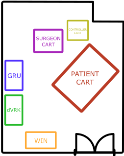
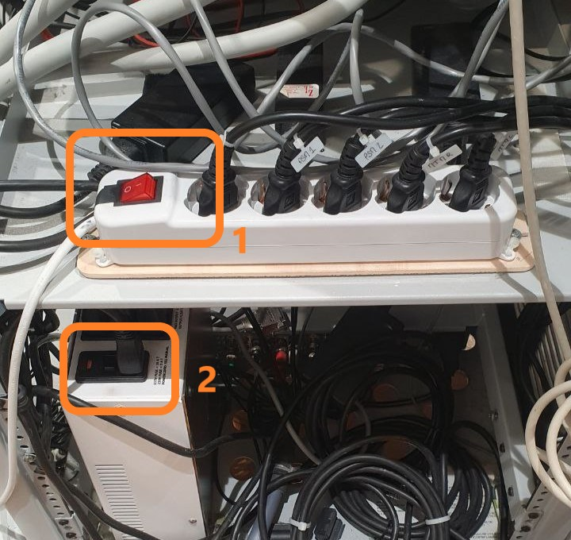
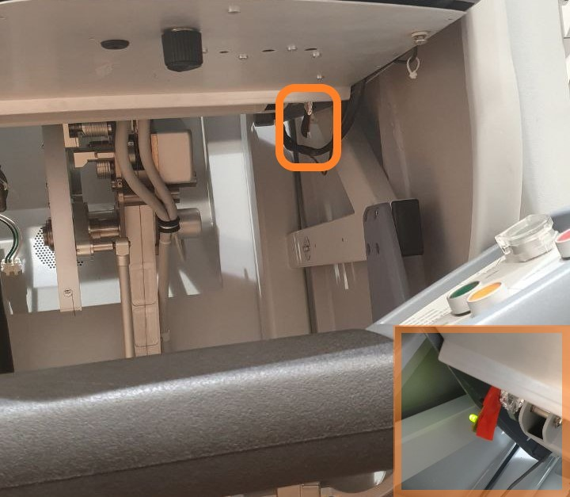
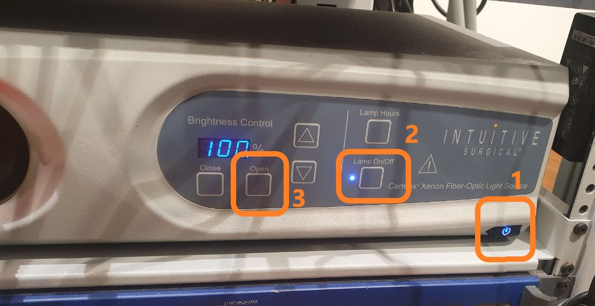
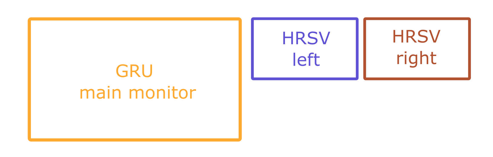

<p align="center"> 
<a>
<picture>
  <source media="(prefers-color-scheme: dark)" srcset="images/banner_light.png">
   
</picture>
</a> </p>

# A comprehensive guide for the *daVinci* robot at NEARLab-Medical Robotics
*This guide is made and maintained by [Alberto Rota](https://nearlab.polimi.it/medical/alberto-rota/). Contributes, issues and corrections are welcome at [Alberto's email](mailto:alberto1.rota@polimi.it).*
***

**TABLE OF CONTENTS**
- [Lab configuration and nomenclature network connectivity](#lab-configuration-and-nomenclature-network-connectivity)
- [Requirements](#requirements)
- [ROS network startup](#ros-network-startup)
- [The *daVinci* for teleoperation](#the-davinci-for-teleoperation)
  - [STEP 1 - Power the robot](#step-1---power-the-robot)
  - [STEP 2 - Turn on the HRSVs](#step-2---turn-on-the-hrsvs)
  - [STEP 3 - Turn on the endoscope lighting system](#step-3---turn-on-the-endoscope-lighting-system)
  - [STEP 4 - Start the ROS framework](#step-4---start-the-ros-framework)
  - [STEP 5 - Start the dVRK control console](#step-5---start-the-dvrk-control-console)
- [Available demos](#available-demos)

## Lab configuration and nomenclature network connectivity 
The *daVinci* room of NEARLab-Medical Robotics is equipped with the following devices:
- 1 Patient Cart equipped with 2 functional PSMs (PSM1 and PSM2), 1 non functional PSM (PSM3), and 1 functional ECM
- 1 Surgeon Cart equipped with 2 functional MTMs (MTMR and MTML), and one HRSV pair
- 1 Controller Cart
- 1 Windows PC (named **WIN**) for computation-heavy tasks
- 1 Ubuntu PC (named **dVRK**) for controlling robot
- 1 Ubuntu PC (named **GRU**) handling the ROS framework
  


IP addresses of the computers are fixed and are the following:
- **GRU**: 192.168.1.1
- **dVRK**: 192.198.1.2
- **WIN**: 192.168.1.3
  
If you connect to the local network via Ethernet, your IP address will be assigned automatically by the router and it will be static. 

Check your IP address by running `ifconfig` in a terminal (Linux) or `ipconfig` in a command prompt (Windows).  

## Requirements 

To send/recieve messages to/from the robot, like joint positions, teleoperation commands, you need to be connected to the local network (wired only for secutiry reasons) via an Ethernet cable. An Ethernet access point is available between **GRU** and **dVRK**; Ethernet cables are available around the room. If your computer does not have an Ethernet port, you can use a USB Ethernet adapter

 **Ethernet Adapter** ➔  🌐 [Amazon link](https://www.amazon.it/s?k=ethernet+usb+c&sprefix=ethern%2Caps%2C183&ref=nb_sb_ss_ts-doa-p_3_6)

A ROS framework is the most important layer of communication in the *daVinci* room. Download *ROS Noetic* to access this framework: **ROS is necessary if you need to get the robot data on your computer, including the camera feeds**

**NOTE:** ROS works only on Linux
* If you have a Windows PC: [Install WSL](https://learn.microsoft.com/en-us/windows/wsl/install), a command-line only Linux environment which runs inside windows, 
* If you have a Mac: You’ll need to install a Virtual Machine, [this video](https://www.youtube.com/watch?v=Hzji7w882OY) may help you 
* If you have Linux PC: Make sure it’s 20.04 (Focal)
  
**ROS Noetic** ➔ 🌐 [Download link](http://wiki.ros.org/noetic/Installation/Ubuntu)


## ROS network startup
The *daVinci* room is equipped with a ROS network that handles the communication between all the computer and the interfaces. 
To start up the ROS network, run the ROSMASTER node on **GRU**: open a terminal and run 
```
roscore
```

If you open the terminal inside a python virtual environment and `(base)` is displayed before the terminal prompt, you have to deactivate the virtual environment by running the command `cda` before running `roscore`.

Check that the output is correct and that the `ROS_MASTER_URI` variable is set to `http://192.168.1.1:11311/`

To check if a computer is connected to the ROS network, run `rostopic list` in a terminal. If the computer is connected, you will see a long list of topics, most starting with `/dvrk/...`. 
If you are not connected to the network, you will see an error message like `ERROR: Unable to communicate with master!`. In that case, some troubleshooting tips are:
- Check that the computer is properly connected to the local network via Ethernet cable (Ethernet cables become "loose" over time, and they may disconnect by themselves)
- Check that on your computer, the `ROS_MASTER_URI` variable is set to `http://192.168.1.1/11311/`. Do this by running `echo $ROS_MASTER_URI` in a terminal.
  If `ROS_MASTER_URI` is not correct, run 
  ```
  export ROS_MASTER_URI=http://192.168.1.1/11311/ 
  ```

- Check that on your computer, the `ROS_IP` variable is set to the IP of your own computer. Do this by running `echo $ROS_IP` in a terminal and compare it with the output of `ifconfig` (by now I assume that you are using Ubuntu or WSL). If `ROS_IP` is not correct, obtain your IP and then run 
  ```
  export ROS_IP=<your IP> 
  ```

## The *daVinci* for teleoperation

### STEP 1 - Power the robot
On the back of the Controller Cart, turn on the main power switch [1] and the endoscope power switch [2], as indicated in the figure

 

### STEP 2 - Turn on the HRSVs
At the surgical console, no video should be displayed inside the binocular. To turn on these displays reach under the cart (see photo) and press the button on the piece of circuitry highlighted in orange in the pic. The button is not immediately reachable, but it's easy to find by touching the component. 



Once the button is pressed, an LED should turn on.
The LED light is:
- **OFF** if the display is turned off
- **ORANGE** if the display is turned on but it's not connected to any video source
- **GREEN** if the display is turned on and connected to a video source
  
If it's green, check that something is visible inside the HRSV ocular.

Repeat the procedure for the other button (there is one on the left and one on the right).

Each of the two HRSVs acts as a separate HDMI monitor and it will display as so into the display manager of your OS.

### STEP 3 - Turn on the endoscope lighting system
Make sure you powered on the endoscope by turning on the power switch on the back of the Controller Cart.

On the front of the controller cart, press the buttons in the order indicated in the figure below, specifically:
- Turn on the front Power Switch of the optic fiber system
- Lamp ON
- Brightness Control OPEN to 100%



The tip of the endoscope mounted on the patient cart should be now emitting an intense light.

### STEP 4 - Start the ROS framework
If you need to view the endoscope camera feeds (left and right), INSTEAD OF STARTING THE ROSMASTER with the `roscore` command, in a terminal on **GRU** (outside of the `(base)` conda virtual environment) use
```
terminator -l vision
```
or its alias
```
tvl
```
It opens multiple terminals and runs multiple ROS nodes (**including the ROSMASTER, so before running this command check that no ROSMASTER is running**). It also opens two windows with the LEFT and RIGHT camera feed separately: to view the camera feeds inside the HRSVs and have 3D depth perception, drag the windows outside the right border of the main monitor on GRU and into the HRSV monitors. The monitors should be set up in this configuration: if you are in doubt, search for *Display Settings* in Ubuntu.



Check that the HMDIs from the HRSV screens are connected to GRU

See the [ROS network startup](#ros-network-startup) section if you don't need to see the camera feeds or if you need troubleshooting tips.

### STEP 5 - Start the dVRK control console
Switch to the **dVRK** computer.


## Available demos